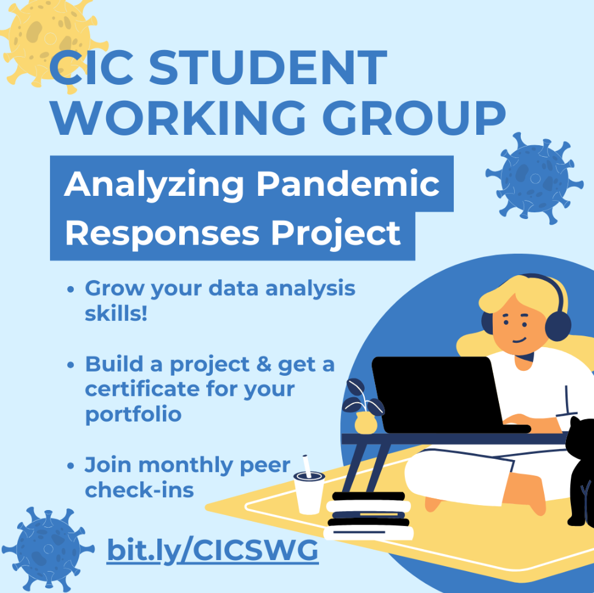

# Analyzing Pandemic Response
 <body>

    

    <b>CIC Working Group - Analyze The Pandemic Response Project
    </b>

     

   

        
   

   

        
The COVID Information Commons (CIC) Student Working Group has developed a new COVID-19 data science project for our members!
             Over the next nine weeks (February 4th - April 5th, 2024), Working
             Group members may participate in the below data science project, learning
             how to analyze government policy responses to the COVID-19 pandemic.
             We will use the extensive Oxford COVID-19 Government Response Tracker
             (OxCGRT) dataset (details below) to perform our analysis. Together, we
             will learn new skills, practice advanced quantitative and qualitative methods,
             and uncover evidence-based insights that illuminate effective strategies
             for future pandemics. The dataset's complexity offers immense potential to 
             identify and understand the most impactful policies in managing global health
             crises.

   

</body> 
